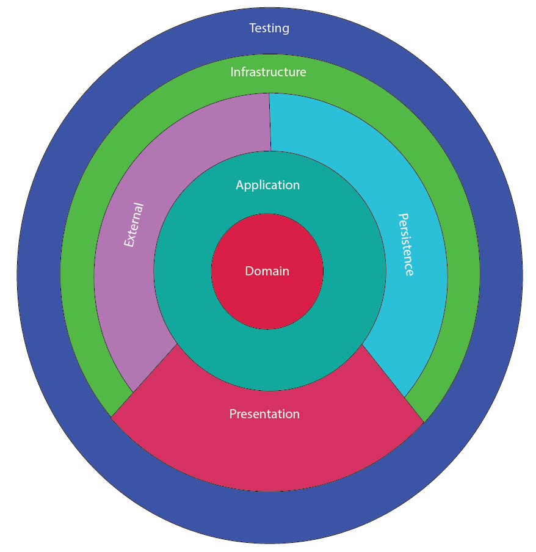

# ARQUITECTURA LIMPIA CON SAGA

[](https://github.com/evrone/go-clean-template/blob/master/LICENSE)
[](https://github.com/evrone/go-clean-template/releases/)

Esta arquitectura esta diseñada para la implementación de una arquitectura limpia para [React JS](https://reactjs.org)  aplicado [Redux](https://redux.js.org) y [Saga](https://redux-saga.js.org). 



## Estructura 
Para generar la estructura se creó una estructura fácil de implementar y mantener, basada una arquitectura limpia y una arquitectura flux. para nuestro caso se dividió en 5 capas la cuales deben respetar los principios SOLID y adaptarlos se acuerdo con las necesidades de la compañía. Cabe resaltar que esta estructura cambia un poco de lo que normalmente se trabaja ya que se quiere un desacoplamiento absoluto de la solución y a su vez garantizar el crecimiento de la aplicación a medida que la lógica se vuelva más compleja.

```
  project
    |
    |___ src /
    |      |
    |      |__ application /
    |      |
    |      |__ domain /
    |      |
    |      |__ infrastructure /
    |      |
    |      |__ presentation /
    |      |
    |      |__ app.tsx
    |      |
    |      |__ index.tsx
    |      |
    |      |__ react-app-end.d.ts
    |      |
    |      |__ reportWebVitals.ts
    |
    |___ test /
```

### Domain:
Esta capa es la encargada de manejar la definicion, basicamente todas las clases e interfaces que sean de definición tales como DTO, entidades o abstraccion de las definiciones debe quedar en esta capa. *Esta capa no deberia tener referencia a ninguna otra capa* 

```
 domain/
    |___ interfaces/
    |       |
    |       |___ application/
    |       |
    |       |___ infrastructure/
    |       |       |
    |       |       |___ external/
    |       |       |
    |       |       |___ persistence/
    |       |
    |       |___ presentation/
    |
    |___ [module name]/
    |       |
    |       |____ models/
    |       |
    |       |____ states/
    |       |
    |       |____ dtos/
    |
    |___ dependencyInjectionDomain.tsx 
```
#### Interface:
Una interface se conoce como la definición, sin logica solo una estructura, dentro de esta carpeta se usaran todas interfaces requeridas para la injección de dependencias. Estas estaran organizadas por carpetas por cada capa como es application e infrastructure.

#### Module Name:
Para mantener el orden dentro del dominio se usara una carpeta por cada uno de los modulos o divisiones propias de cada proyecto. dentro de este se deben manejar una estructura dada por unas sub carpetas.

 - models: En esta carpeta contiene las clases que se podran usar como entidades internas dentro de la solución, un ejemplo de esto puede ser al almacenar datos en memoria o al usar un storage local estas clases podrias realizar una serialización para mejorar la manipulación de los datos.
  
 - states: ya que manejamos redux se requiren estados dentro de la solución, en esta carpeta se guardaran todos los estados correspondientes al modulo. La idea es que estas clases sean las mismas que usamos en redux al consolidar los reducers.
  
 - dtos: Normalmente se requiere consumir servicios de API o Web Socket para eso se usara esta carpeta, se debe colocar en esta los request y los response necesarios para el trabajo requerido con los servicios externos.
  
 - dependencyInjectionDomain.tsx: es este archivo se agregar todas la inyecciones de dependencia que tiene la capa domain si no se requiere se debe mantener por estructura de la solución.


### Application:
Para el manejo de la logica se usara esta capa, muchas personas catalogan esta capa como casos de uso para efectos practicos los usaremos de la misma manera. Esta capa tiene la responsabilidad de manejar toda la logica de negocio y si es posible toda la logica de la solución. Es importante resaltar que muchas veces se cae en el errro de repertir codigo en esta capa ya que al usar un patron mediator separamos practicamente una clase por fucnionadlidad y esto hace que se repita el muchas veces la logica *en la medida de lo posible si llega a pasar esto enviar la logica a una clase comun en el common* pero se debe evaluar en que casos vale la pena realizar esta opetación.

Vale la pena resaltar que la unica relación valida para applicación es Domain no debe tener ninguna relacion con persistence, external o con cualquier otra clase externa a application o domain 

```
 application/
    |
    |___ commons/
    |
    |___ [module name]/
    |       |
    |       |____ [Use case]Application.ts
    |       |
    |       |____ commons
    |       |
    |       |____ [Name Subprocess]/
    |
    |___ dependencyApplication.tsx 
```

#### Common:
En esta carpeta se incluye toda la logica comun dentro de la solución, es importante resaltar que si existe logica que solo aplique a un modulo no deberia ir en esta carpeta.

#### Module Name:
Para mejorar la organización se usaran carpetas con el nombre del modulo, estas contendran un conjunto de logica organizada en casos de uso los cuales resolveran o realizaran una sola accion. Esta clase debe tener un metodo handler el cual ejecutara la acción. Si se quieren usar mas metodos deben ser private o protected.

- [Use case]Application.ts: Estos archivos deberan tener una unica funcionalidad, dada en el metodo handler el cual se encargara de ejecutar el application
  
- Commons: toda la logica comun que aplique para el modulo deberia ir en esta carpeta. Se debe evaluar si vale la pena pasar la logica en esta parte ya que muchas veces todo se vuelve comun y la logica se vuelve compleja 

- dependencyInjectionApplication.tsx: es este archivo se agregar todas la inyecciones de dependencia que tiene la capa application si no se requiere se debe mantener por estructura de la solución.

### Infrastructure:
Siempre que se quiera usar acceso a información externa ya sea una base de datos, servicios REST o culaquier tipo de repositorio se debe hacer en esta capa. Vale la pena resaltar que solo debe hacer la conexion no debe tener logica de negocio y mucho menos integración directa con application. Tambien todas la clases deberian tener asociada una interface de domain si son consumidas desde application.

```
 infrastructure/
    |
    |___ external/
    |       |
    |       |____ [Provider Name]/
    |
    |___ persistence/
    |       |
    |       |____ repositories/
    |       |       |
    |       |       |____ [Name Segment]Repository.ts
    |       |
    |       |____ contexts/
    |
    |___ dependencyInfrastructure.tsx 
```

#### External: 
Toda conexion externa a la solución se debe realizar en esta carpeta ya sea a un sevicio REST, un Web Socket o silares. Se recalca que esta capa no deberia tener logica solo debe ser la conexion y si es necesario un mapeo a las clases requeridas para continuar con la ejecución. Toda conexion debe estar en una carpeta con el nombre del proveedor. Si son muchos llamados se debe divivir por carpetas internas de acuerdo a las necesidades de los llamdados.

#### Persistence:
Para conexiones a base de datos o storage local debe trabajarse en esta carpeta, la idea es que si se llegue a cambiar de conexion el impacto sea  minimo y solo sea cambiar en este caso el contexto de llamado al proveedor.
- Repositories: Esta carpeta contara con un patron repository serparando la informacion de acuerdo a tablas o grupos de tablas relacionadas, si es necesario deberia crear sub carpetas para mejorar el orden de la solución.
- Contexts: Estas son la conexiones a las bases de datos o storage locales. como se menciono anteriormente la idea es que estos puedan ser reemplazados o modificados con facilidad.


### Presentation:
Esta capa esta realizada con ReactJS y Redux Saga, Lo que se busca con esta capa es centralzar todo lo conserniente a visualización. Esta capa no debe tener logica y debe ser manejada en su totalidad por Redux.